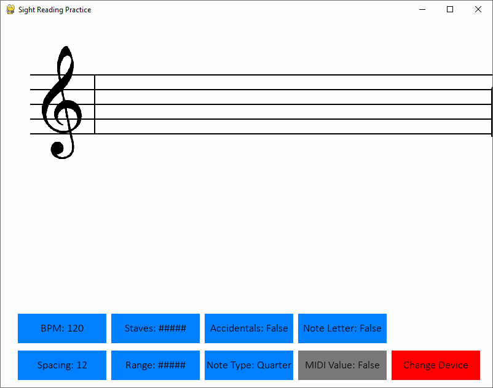
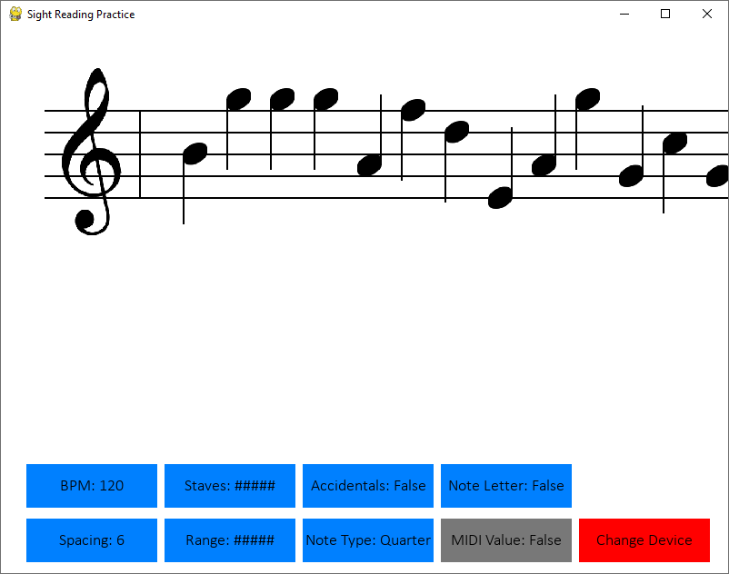
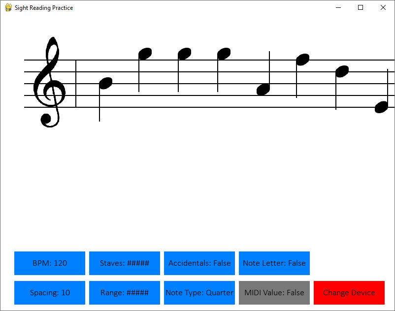
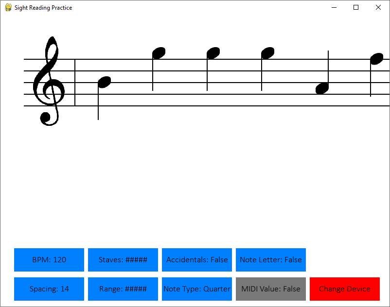
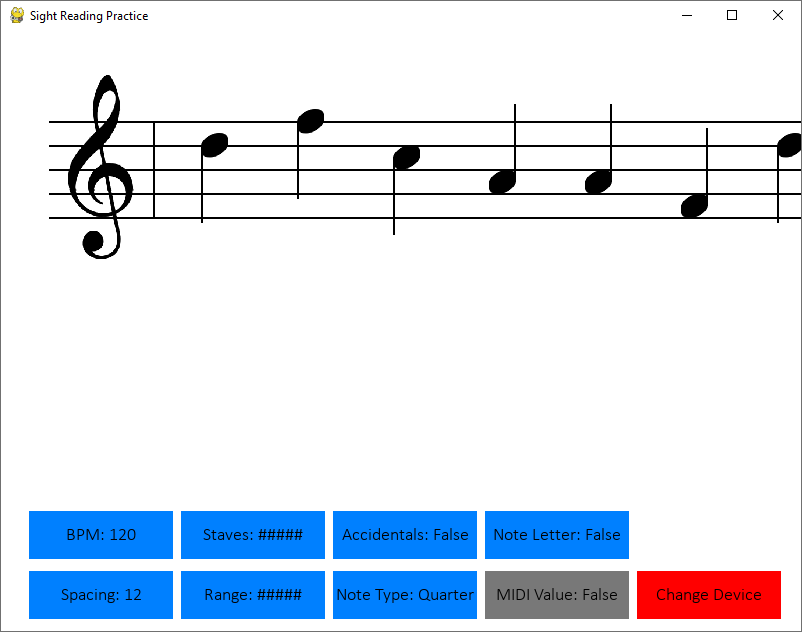
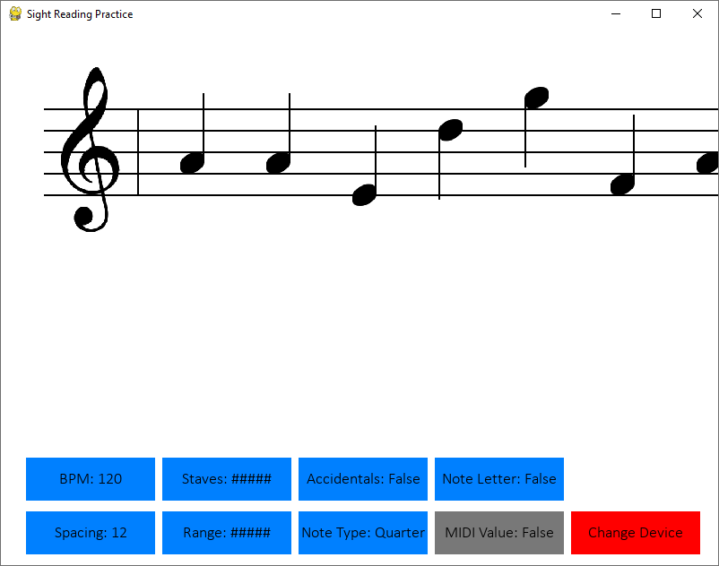
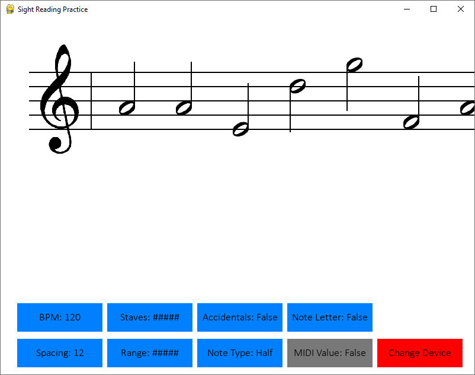
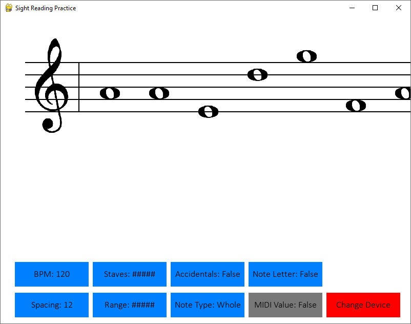

# Piano Sight Reading Practice

## Description

This is a python program made to provide practice with sight reading piano music.

It produces a pygame window that displays sheet music staves and generates an endless score by sliding in random notes from the right edge of the screen.

The program reads input values from a connected MIDI device and compares them to the foremost note, making the note disappear when the correct key is pressed, and pausing the note movement if the user falls far enough behind.

## To Do

- Finish implementing multiple staves
- Automatic speed scaling based on rate of correct inputs
- Randomly varying note durations (with appropriate spacing and rests)
- Ability to generate one note on each staff simultaneously
- Ability to generate chords
- Ability to import sheet music

## Installation

Requires:
- Python 3
- PyGame
- MIDI Device (or use can be simulated with the keyboard)

## Operation

### Device Selection

Initially, the UI will prompt for a MIDI device to be selected (or the user can re-scan the devices).

### Playing

Upon selection, the UI will display the staves and start moving notes toward the clefs from offscreen at regular spacing intervals. 

The goal is to press the piano (MIDI) key that corresponds with the leftmost note.  Pressing a wrong key will result in a red "X" symbol appearing for feedback, but has no other effect.

Pressing the correct key will display a green "O" symbol and will remove the leftmost note from the screen.  The remainder of the notes will continue moving leftward at constant speed.

### Movement

If the leftmost note reaches the bar line in front of the clef, the entire set of notes will stop.

They will resume moving any time that the leftmost note on the screen is not yet at the bar line, so playing a correct key and removing the foremost note will resume movement.

With multiple staves active, all sets of notes follow the same movement and do not pause or resume independently.

### USER SETTINGS:

Option | Details | 
Example

-------|---------|--------
Note Range			 | This limits the not generation to a certain range of notes, which can help the user focus their practice and can also act as a difficulty modifier |  
BPM					 | This sets the approximate speed at which the notes move, so that hitting the correct notes at this rate means the user will not fall behind or get ahead |  
Note Spacing		 | This changes the amount of horizontal space between each note on the staff in order to match visibility preference |   
Staves Active		 | This sets which staves are active (treble, bass, or both) |   
Accidentals			 | This toggles whether newly generated notes can sometimes have accidentals or never have them.  It will not affect notes already on the screen. |  
Note Type			 | This changes the note symbol (whole note, half note, or quarter note) in order to match visibility preference.  This does not affect rate of play at all. |   
Variable Note Length | This will make the newly generated notes have varying note lengths and can include rests in order to more realistically simulate actual sheet music.  While enabled, this makes the "Note Type" option irrelevant. |  
Simultaneous Notes	 | Disabled means that only a single note will be generated at each location, either on the treble staff or the bass staff.  Enabled means that a note will be generated on both staves for each note position, and so the left and right hands will need to play simultaneously. |  
Note Letter Display	 | This toggles whether or not the note name (e.g. "C#") will display above the notes.  This is useful early in a user's practice while they are still familiarizing themselves with the notes. | 
MIDI Value Display	 | This toggles whether or not the MIDI value (e.g. "64") will display above each note, as well as displaying the input values from the MIDI device above the topmost clef.  It can be used for diagnostics to compare to the input value from the MIDI device. | 